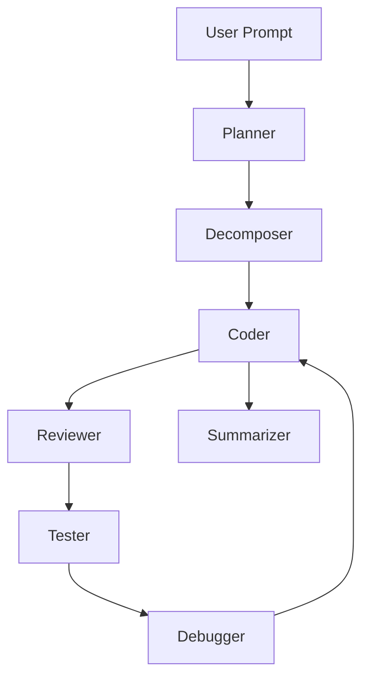

# 🤖 AI Developer’s Assistant – Agent Map

This system is designed as a multi-agent AI architecture for secure, self-contained software development assistance. Each agent has a clearly defined role, input/output specification, and modular responsibility. This enables scalable orchestration, self-debugging, and human override where necessary.

---

## 🗌️ Agent Map

| **Agent**            | **Purpose**                                                              | **Inputs**                                                  | **Outputs**                                                | **Notes**                                                                 |
|----------------------|--------------------------------------------------------------------------|--------------------------------------------------------------|-------------------------------------------------------------|----------------------------------------------------------------------------|
| `Planner`            | Converts a high-level user request into a project-level roadmap          | User prompt                                                  | List of subtasks and goals                                  | Like a product manager or system architect                                |
| `Decomposer`         | Breaks subtasks into atomic development units (features, functions)      | Task from Planner                                            | JSON list of discrete implementation tasks                  | Similar to a technical lead                                               |
| `Workspace Loader`   | Reads and preprocesses project files for context and memory              | Project directory                                            | Indexed chunks (for embeddings)                             | Powers file-aware agents via RAG                                          |
| `Retriever (RAG)`    | Fetches relevant file/code snippets based on task requirements           | Query + Embedding index                                     | Ranked document or file list                                | Used by `Coder`, `Reviewer`, `Debugger`                                  |
| `Coder`              | Generates or modifies code to fulfill a single subtask                   | Task + relevant context                                      | Code block + rationale                                      | Could support few-shot or chain-of-thought prompting                      |
| `Reviewer`           | Reviews AI-generated code for style, bugs, and best practices            | Code block                                                   | Inline feedback, rating, or suggested refactor              | May use GPT-based static analysis or rule-based LLM chains                |
| `Tester`             | Creates and/or runs tests on code output                                 | Code block or file                                           | Test cases or test results                                  | Useful for validating `Coder` output                                      |
| `Debugger`           | Explains error logs and proposes fixes                                   | Logs + code context                                          | Diagnosis and suggested fix                                 | May re-trigger `Coder` or flag error upstream                             |
| `Summarizer`         | Generates documentation and context explanations                         | Code + metadata                                              | Markdown docs, inline comments, or usage summaries          | Supports automated README and API doc generation                         |
| _(Optional)_ `Supervisor` | Oversees pipeline orchestration, error recovery, and task status        | Status reports from agents                                   | Agent instructions or retries                               | Could later evolve into autonomous executor                               |

---

## 🧹 Agent Communication

All agents are designed to operate as **stateless functions** with shared access to:
- A **project-wide embedding index** (via Workspace Loader + Retriever)
- A **task manager** or orchestrator (e.g. FastAPI endpoint or event bus)
- A standard **message format** (likely JSON-based)

---

## ✅ Flow (draft)

---

## ✨ Design Philosophy

- **Modular**: Each agent can be developed and improved independently.
- **Auditable**: Every step can be logged and reviewed.
- **File-Aware**: Context is informed by actual project files via RAG.
- **Secure by Default**: No calls to external APIs unless explicitly authorized.

