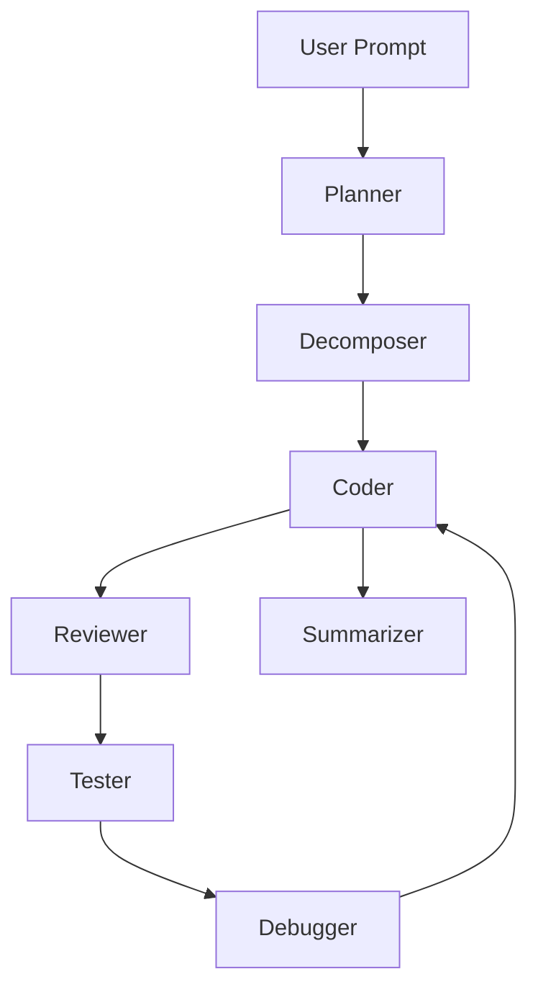

# 🤖 AI Developer’s Assistant – Agent Map

This system is designed as a multi-agent AI architecture for secure, self-contained software development assistance. Each agent has a clearly defined role, input/output specification, and modular responsibility. This enables scalable orchestration, self-debugging, and human override where necessary.

---

## 🗌️ Agent Map

| **Agent**            | **Purpose**                                                              | **Inputs**                                                  | **Outputs**                                                | **Notes**                                                                 |
|----------------------|--------------------------------------------------------------------------|--------------------------------------------------------------|-------------------------------------------------------------|----------------------------------------------------------------------------|
| `Planner`            | Converts a high-level user request into a project-level roadmap          | User prompt                                                  | List of subtasks and goals                                  | Like a product manager or system architect                                |
| `Decomposer`         | Breaks subtasks into atomic development units (features, functions)      | Task from Planner                                            | JSON list of discrete implementation tasks                  | Similar to a technical lead                                               |
| `Workspace Loader`   | Reads and preprocesses project files for context and memory              | Project directory                                            | Indexed chunks (for embeddings)                             | Powers file-aware agents via RAG                                          |
| `Retriever (RAG)`    | Fetches relevant file/code snippets based on task requirements           | Query + Embedding index                                     | Ranked document or file list                                | Used by `Coder`, `Reviewer`, `Debugger`                                  |
| `Coder`              | Generates or modifies code to fulfill a single subtask                   | Task + relevant context                                      | Code block + rationale                                      | Could support few-shot or chain-of-thought prompting                      |
| `Reviewer`           | Reviews AI-generated code for style, bugs, and best practices            | Code block                                                   | Inline feedback, rating, or suggested refactor              | May use GPT-based static analysis or rule-based LLM chains                |
| `Tester`             | Creates and/or runs tests on code output                                 | Code block or file                                           | Test cases or test results                                  | Useful for validating `Coder` output                                      |
| `Debugger`           | Explains error logs and proposes fixes                                   | Logs + code context                                          | Diagnosis and suggested fix                                 | May re-trigger `Coder` or flag error upstream                             |
| `Summarizer`         | Generates documentation and context explanations                         | Code + metadata                                              | Markdown docs, inline comments, or usage summaries          | Supports automated README and API doc generation                         |
| _(Optional)_ `Supervisor` | Oversees pipeline orchestration, error recovery, and task status        | Status reports from agents                                   | Agent instructions or retries                               | Could later evolve into autonomous executor                               |

---

## 🧹 Agent Communication

All agents are designed to operate as **stateless functions** with shared access to:
- A **project-wide embedding index** (via Workspace Loader + Retriever)
- A **task manager** or orchestrator (e.g. FastAPI endpoint or event bus)
- A standard **message format** (likely JSON-based)

---

## ✅ Flow (draft)

---

## ✨ Design Philosophy

- **Modular**: Each agent can be developed and improved independently.
- **Auditable**: Every step can be logged and reviewed.
- **File-Aware**: Context is informed by actual project files via RAG.
- **Secure by Default**: No calls to external APIs unless explicitly authorized.

# -------AGENT MAP 2----------

# AI Developer’s Assistant – Agent Architecture Map

## Overview
This architecture defines a modular, agent-based system designed to function as an intelligent "robot that builds robots." Each agent is responsible for a clearly defined task and communicates with others via structured APIs or messaging systems. The system supports RAG (Retrieval-Augmented Generation), autonomous planning, evaluation, and correction. This structure is extensible, allowing for new agents like UI generators and linters to be added seamlessly.

---

## 🧠 Core Agents

### 1. **Supervisor Agent**
- **Role**: Orchestrates and delegates tasks to the other agents. Handles high-level coordination, project state management, and error handling.
- **Input**: User objectives, task completions, errors from Evaluator.
- **Output**: Task assignments, re-routing, logging.
- **Tech**: Finite State Machine + Memory Stack.

---

## 🏗️ Generation Agents

### 2. **Architect Agent**
- **Role**: Converts user input (prompt/spec) into high-level application design and task plans.
- **Input**: Natural language prompts.
- **Output**: Project blueprint → components + dependencies + desired UX behavior.
- **Tech**: Large language model with schema generators (e.g. JSON, YAML).

### 3. **Decomposer Agent**
- **Role**: Breaks large tasks into smaller, executable subtasks.
- **Input**: Architect plan.
- **Output**: Ordered task list for implementation.

### 4. **Codegen Agent**
- **Role**: Writes source code for a specific module or file.
- **Input**: Functional spec and file context (via RAG).
- **Output**: One or more code files (inferred language).

### 5. **UI Generator Agent**
- **Role**: Creates styled UI components (React, HTML, Tailwind, etc.) from wireframes or UX descriptions.
- **Input**: Component names, user interactions, UX instructions.
- **Output**: Fully formed UI component code + optional CSS modules.

---

## 🔍 Validation Agents

### 6. **Evaluator Agent**
- **Role**: Analyzes generated code and reports issues, bugs, or inconsistencies.
- **Input**: Code diffs or full source files.
- **Output**: Analysis report (natural language or structured).

### 7. **Lint Fixer Agent**
- **Role**: Applies linting rules, style conventions, and auto-fixes to maintain clean, idiomatic code.
- **Input**: Raw code.
- **Output**: Formatted code + description of applied lint rules.
- **Ruleset**: Configurable per language (e.g., ESLint, Black, Prettier).

### 8. **Test Agent**
- **Role**: Writes unit and integration tests.
- **Input**: Target source code.
- **Output**: Test files (e.g. Jest, PyTest, Mocha).

---

## 🔧 Runtime + Feedback Agents

### 9. **Runner Agent**
- **Role**: Executes application components in sandbox mode to detect runtime issues.
- **Input**: Built project (or isolated files).
- **Output**: Runtime logs, stack traces, performance metrics.

### 10. **Debugger Agent**
- **Role**: Diagnoses errors based on logs or test failures. Suggests or makes code fixes.
- **Input**: Stack trace or test result + file context.
- **Output**: Patch or edit suggestions.

---

## 📚 Retrieval & Memory Layer

### 11. **RAG Engine (Context Retriever)**
- **Role**: Supplies agents with the most relevant project files or specs.
- **Input**: Embedding query + task description.
- **Output**: Ranked list of file/document snippets.

---

## 🔁 Feedback & Looping
- Each agent can optionally send output to the **Supervisor** for validation before proceeding.
- **Evaluator** and **Runner** may feed into **Debugger**, which either loops back to **Codegen** or applies auto-patches.

---

## Notes for Development
- All agents are stateless and can be deployed as microservices.
- Long-term memory (project state, changes) is persisted in a vector DB + task ledger.
- Agent behavior is prompt-engineered and can be tuned over time.

---

## Roadmap Considerations
- Add a **User Conversation Tracker** to keep track of goals and agent outputs.
- Add **Frontend Bridge** to support real-time updates (e.g., WebSocket).
- Support offline mode with snapshot-aware agents and embedded context.

---

This map serves as the foundation for designing a multi-agent AI software engineer. Updates should be recorded as architectural decisions or Trello cards.

