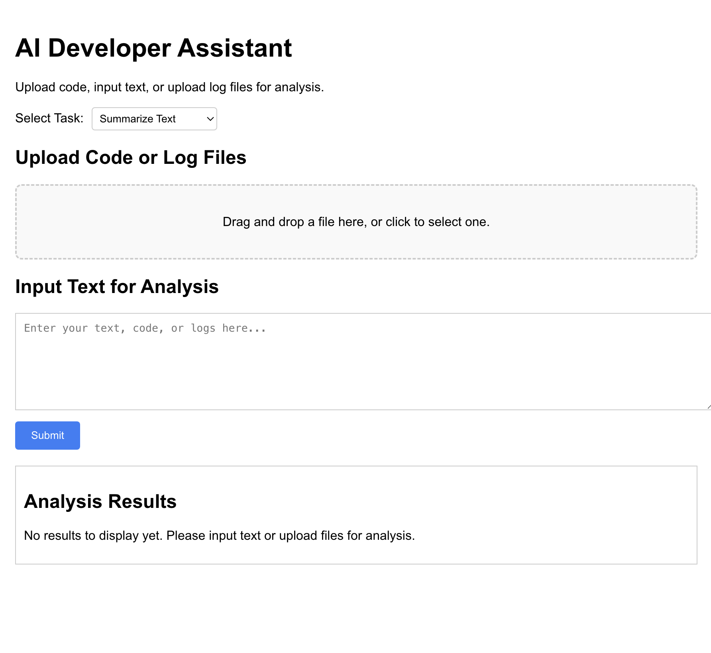

# AI Developer Assistant Frontend

This document outlines the frontend implementation of the AI Developer Assistant application, which is part of a broader system designed to facilitate text summarization, code analysis, and log error detection. The frontend leverages industry-standard technologies and principles to ensure scalability, maintainability, and a seamless user experience.

---

## Key Features

- **Task Selection**: Users can select between text summarization, code analysis, or log error detection through an intuitive dropdown interface.
- **File Upload**: Drag-and-drop functionality for uploading files, with support for `.txt`, `.log`, `.js`, `.py`, and `.java` files.
- **Dynamic Syntax Highlighting**: Results are displayed with syntax highlighting using `react-syntax-highlighter`.
- **Responsive Design**: A mobile-friendly interface built using modern CSS practices.
- **Error Handling**: Robust error messages guide users through the application.
- **API Integration**: Seamlessly communicates with the backend for task-specific processing.

---

## Technologies Used

- **React**: Frontend framework for building the user interface.
- **TypeScript**: Strongly typed language for better code reliability.
- **React Syntax Highlighter**: Provides syntax highlighting for displayed results.
- **Axios**: Handles HTTP requests to the backend.
- **React Testing Library & Jest**: Ensures code quality through comprehensive tests.

---

## Installation

1. **Clone the Repository**:
   ```bash
   git clone https://github.com/your-repo/ai-developer-assistant-frontend.git
   cd ai-developer-assistant-frontend
   ```

2. **Install Dependencies**:
   ```bash
   npm install
   ```

3. **Start the Development Server**:
   ```bash
   npm start
   ```

4. **Access the Application**:
   Open your browser and navigate to `http://localhost:3000`.

#### Screenshot of the Landing Page/Form




---

## Architecture

The frontend is structured to prioritize modularity and reusability:

- **Components**:
  - `FileUpload`: Handles file drag-and-drop and upload functionality.
  - `Homepage`: Manages the overall UI layout and interactions.
  - `TaskSelector`: Provides a dropdown interface for selecting tasks.

- **Utilities**:
  - `api.ts`: Abstracts Axios API calls.
  - `detectLanguage.ts`: Determines the programming language based on file extension.

- **Styling**:
  - Custom CSS and media queries ensure responsiveness.

---

## Testing

- **Unit Tests**:
  - Coverage for all critical components using React Testing Library.
- **Integration Tests**:
  - Simulates user interactions and validates API calls.

To run tests:
```bash
npm test
```

---

## Developer Notes

### Coding Standards
- **Component Design**: All components are functional and typed with TypeScript.
- **State Management**: Managed using React hooks for simplicity and scalability.
- **Error Handling**: Centralized to provide consistent user feedback.

### Extensibility
- Adding new tasks: Define a new API route in `api.ts`, update the task selector options, and add handling logic in `Homepage.tsx`.
- The architecture supports further modularization and scaling.

---

## Contribution

We welcome contributions from the developer community. Please follow these steps:
1. Fork the repository.
2. Create a feature branch.
3. Submit a pull request.

For detailed guidelines, refer to `CONTRIBUTING.md`.

---

## License

This project is licensed under the MIT License. See the `LICENSE` file for details.

---

For more information, feel free to contact the project maintainer at `your.email@example.com`.
